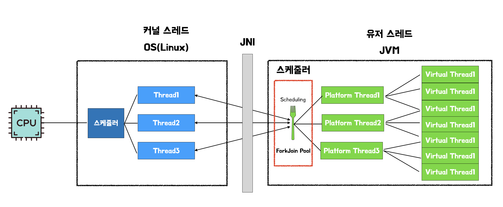
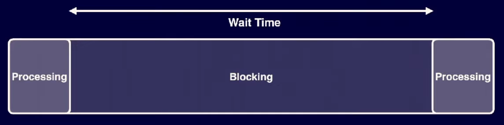

# Virtual Thread

## 전통적인 Java의 Thread (Platform Thread)

- 전통적인 Java의 Thread는 OS Thread와 1:1로 매칭됨
- Java 애플리케이션에서 Thread를 사용하면 실제로는 OS Thread를 사용한 것
- 애플리케이션에서는 Platform Thread를 효율적으로 사용하기 위해 Thread Pool을 사용함



### 한계

- Throughput
  - OS Thread는 생성 될 때 독립적인 메모리 공간(Stack)을 할당 받아 상당한 시스템 자원을 소모함
  - Thread를 수천, 수만 개씩 만드는 것은 시스템에 큰 부담이 되어 처리량이 저하됨
- Context Switching
  - 하나의 CPU에서 여러 Thread를 번갈이 실행할 때, OS는 현재 Thread의 상태를 저장하고 다음 Thread의 상태를 불러오는 Context Switching을 수행함
  - Context Switching은 비용이 많이 드는 작업이라 잦은 전환은 성능 저하의 원인이 됨
- Blocking I/O

  - Thread가 데이터베이스 조회나 API 호출과 같은 I/O 작업을 기다리는 동안, 해당 Thread는 아무 일도 하지 않으면서 OS Thread 자원을 계속 점유함
  - 작업을 처리하는 시간보다 대기하는 시간이 긴 경우가 발생하여 자원이 비효율적으로 사용됨

  

### Thread Pool

- 미리 만들어 둔 여러 개의 Thread를 재사용해서 작업을 효율적으로 처리하는 구조

- **동작 구조**

  - 작업 처리에 사용되는 Thread를 제한된 개수만큼 정해 놓고 작업 큐에 들어오는 작업들을 일이 없는 Thread가 맡아서 처리함
  - 처리가 끝난 Thread는 수거 되는 것이 아니라 다시 Thread Pool로 돌아와서 다음 작업을 대기함
  - 제한된 개수의 Thread를 운용하며 Thread가 무제한으로 생성되는 것을 방지함


## Reactive Programming

- 데이터의 흐름과 변화의 전파에 중점을 둔 비동기 프로그래밍 패러다임
- Thread가 작업을 기다리며 멈추지 않고 작업이 완료되면 알림을 받아 다음 동작을 수행하는 non-blocking 방식으로 동작함


### 특징

- 하나의 Thread가 두 개 이상의 Request를 처리할 수 있음
- 컴퓨터 자원을 효율적으로 사용할 수 있어 적은 Thread로 더 많은 Request를 처리할 수 있음
- 즉, 처리량을 높일 수 있음

### 한계

- **진입 장벽**
  - 기존에 사용하던 동기적인 방식의 코드와 로직을 전환해야 됨
  - 여러 로직이 맞물릴 때, 하나가 아닌 전체를 비동기로 바꿔야 함
- **코드 이해의 어려움**
  - 프로그래밍 패러다임을 달리 하기에 비즈니스 프로세스가 이 코드에 잘 반영되었는지, 새로운 기능을 추가한다면 어느 부분에 추가해야 하는지 판단하기가 어려움
- **어려워진 디버깅, 예외처리**
  - 기존에는 'Thread per Request' 방식이었기에 문제가 발생하면 콜스택 등을 통해 디버깅하거나 예외처리 하기가 쉬움
  - Reactive Programming은 Request를 여러 Step으로 쪼개고 파이프라인 형태로 엮어서 여러 Thread에서 처리하게 되면서 콜스택 등을 통해 디버깅하거나 예외처리 하기가 어려움

## Virtual Thread

- JVM이 직접 관리하는 경량 스레드 모델
- Platform Thread와 달리 OS Thread에 묶여 있지 않고, Blocking I/O 작업 시 JVM이 Virtual Thread를 일시 중단하고 다른 Virtual Thread를 실행할 수 있음

  

- **지원 버전**

  - JDK 19에서 얼리 액세스로 포함됨 ([JEP 425: Virtual Threads (Preview)](https://openjdk.org/jeps/425))
  - JDK 21부터 정식으로 도입됨

- **동작 원리**

  - 실행될 Virtual Thread의 작업인 runContinuation을 Carrier Thread의 workQueue에 push
  - Work queue에 있는 runContinuation들은 forkJoinPool에 의해 work stealing 방식으로 Carrier Thread에 의해 처리됩니다.
  - 처리되던 runContinuation들은 I/O, Sleep으로 인한 interrupt나 작업 완료 시, work queue에서 pop되어 park과정에 의해 다시 heap 메모리로 되돌아갑니다.

- **동작 흐름**

  - 대기
    - 생성된 Virtual Thread는 `ForkJoinPool`의 Work Steal Queue에서 실행 순서를 기다림
  - `mount()`
    - queue에서 대기하던 Virtual Thread를 한가한 Carrier Thread가 가져와 코드를 실행함
  - `park()`
    - 실행 중이던 `Virtual Thread1`이 Blocking 상황을 만남
    - `Virtual Thread1`은 Carrier Thread을 점유하지 않고 분리됨
    - 자신의 실행 상태를 Heap 메모리에 객체 상태로 저장하고 대기 상태가 됨 (`Virtual Thread2`)
    - `Carrier Thread1`은 다른 Thread를 실행할 수 있는 상태가 됨
  - `unpark()`
    - `Virtual Thread2`의 Blocking 작업이 완료되면 JVM은 Heap 메모리에 저장되어 있던 `Virtual Thread2`을 깨움
    - 깨어난 `Virtual Thread2`는 Work Steal Queue로 들어가 자신의 실행 순서를 기다림

  

### 사용하는 자원의 차이

| 구분                   | Platform Thread             | Virtual Thread       |
| :--------------------- | :-------------------------- | :------------------- |
| Metadata size          | 약 2KB (OS별 차이 있음)     | 200~300B             |
| Memory                 | 미리 할당된 Stack 사용      | 필요시마다 Heap 사용 |
| Context Switching cost | 1~10µs (커널 영역에서 발생) | ns                   |

## 장점

- **자원 효율성**
  - Platform Thread는 Thread마다 고정된 크기의 Stack을 미리 할당 받는 방식이기에 수백만 개의 Thread는 스택 메모리가 제한적이기에 불가능함
  - 최소한의 메모리만 소비하므로 JVM이 시스템을 압도하지 않고 수백만 개의 Thread를 생성할 수 있음
- **Non-blocking 단순성**
  - I/O 작업과 같은 Blocking 작업이 OS Thread 리소스를 낭비하지 않고 처리됨
  - Virtual Thread는 Blocking 시 Thread를 파킹(parking, 일시중단)하여 시스템 리소스를 묶어두지 않음
- **높은 처리량**
  - Virtual Thread는 OS Thread를 낭비하지 않아 초당 더 많은 요청을 처리할 수 있음
  - 지연 시간(Latency)은 감소하고 메모리 사용량도 줄어들어 애플리케이션의 처리량을 향상시킴
- **Platform Thread와의 호환성**
  - 기존 `java.lang.Thread` 타입과 호환 되어 기존 코드 변경 없이도 쉽게 적용할 수 있습니다

## 단점

- **CPU 집약적인 작업에는 부적합**
  - I/O 대기 시간이 긴 작업에 적합하며, CPU 집약적인 장시간 실행 작업에는 적합하지 않음
- **ThreadLocal 변수 사용 고려**
  - 하나의 JVM이 수백만 개의 Virtual Thread를 지원할 수 있기에 `ThreadLocal` 변수의 과도한 사용은 메모리 누수와 성능 저하의 원인이 될 수 있음
- **Thread Pooling의 비효율성**
  - 경량화되어 있는 Virtual Thread는 Thread Pooling 보다 매번 새로운 인스턴스를 생성하는 것을 권장함

## 주의 사항

**Pinning**

- `synchronized` 사용 시 Virtual Thread에 연결된 Carrier Thread가 Blocking 될 수 있음

```
[Pinning 발생]
public synchronized String accessResource() {
  return access();
}

[Pinning 발생하지 않음]
public static final ReentrantLock() {
  LOCK = new ReentrantLock();
}

public String accessResource() {
  LOCK.lock();
  try {
    return access();
  } finally {
    LOCK.unlock();
  }
}
```

## Java에서의 사용

```
Thread.startVirtualThread(() -> {
  System.out.println("Hello Virtual Thread");
})

Runnable runnable = () -> System.out.println("Hi Virtual Thread");
Thread virtualThread1 = Thread.ofVirtual().start(runnable);

Thread.Builder builder = Thread.ofVirtual().name("JVM-Thread");
Thread virtualThread2 = builder.start(runnable);
```

## 출처

- https://nangmandeveloper.tistory.com/6
- https://www.youtube.com/watch?v=vQP6Rs-ywlQ
- https://techblog.woowahan.com/15398/
- https://dzone.com/articles/how-reactive-thread-works-part-2
- https://jofestudio.tistory.com/139
