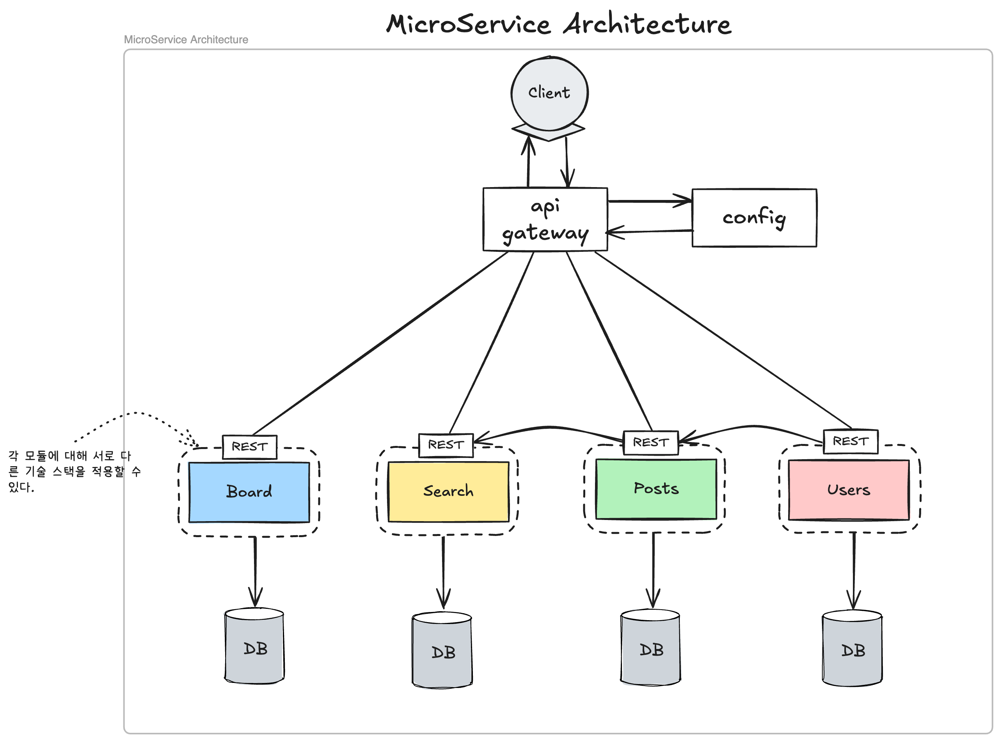
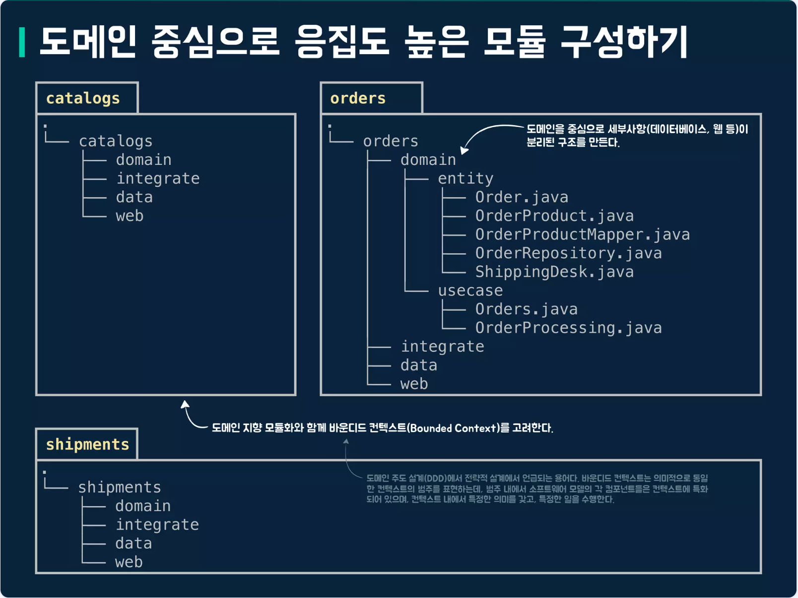
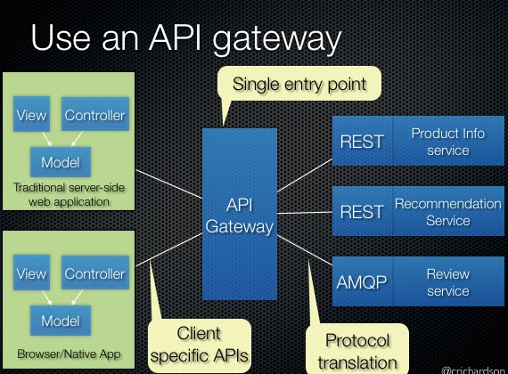
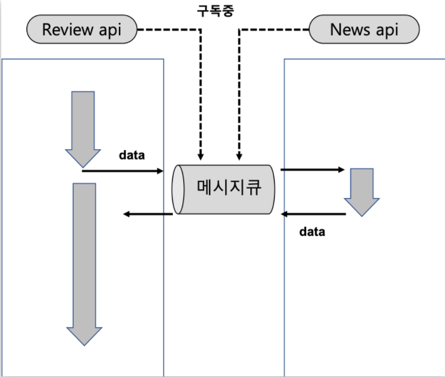

## 1. 마이크로서비스 아키텍처(MSA)의 정의

마이크로서비스 아키텍처(Microservices Architecture, MSA)는 하나의 큰 애플리케이션을 **여러 개의 작은 독립적 서비스들로 나누어 구축하는 방식**입니다.

비즈니스 **도메인 경계**를 중심으로 분리된 **독립적인 서비스**들이 API를 통해 **느슨하게 결합**된 분산 시스템 아키텍쳐입니다.

각 서비스는 **자체 데이터 저장소**를 가지며, **독립적인 배포 라이프사이클**을 따릅니다.

## 2. MSA의 핵심 원칙 및 특징

### 2.1. 비즈니스 역량 중심 (Business Capability-Centric)
각 마이크로서비스는 특정 비즈니스 기능 또는 역량을 중심으로 설계되어야합니다. 

### 2.2. 단일 책임 원칙(Single Responsibility Principle, SRP)
각 서비스는 **단일 책임 원칙(Single Responsibility Principle, SRP)** 을 따라야 하며, 하나의 변경 이유만 가져야 합니다.

### 2.3. 분산 데이터 관리(Decentralized Data Management)
각 서비스는 자체 데이터 저장소를 가지며, 데이터베이스 스키마도 독립적으로 관리합니다.
이는 서비스 간의 결합도를 낮추고, 각 서비스가 자신의 데이터 모델을 최적화할 수 있게 합니다.

### 2.4. 도메인 주도 설계(DDD, Domain-Driven Design)

서비스 경계를 설정하는데 DDD의 **경계 컨텍스트(Bounded Contexts)** 개념을 활용합니다. 
이는 서비스 간의 명확한 책임 분리를 돕고, 비즈니스 도메인에 맞춘 설계를 가능하게 합니다.
DDD를 통해 느슨한 결합과 높은 응집력을 가진 서비스를 설계할 수 있습니다.
- 경계 컨텍스트(Bounded Contexts)

    비즈니스 도메인의 특정 부분을 나타내며, 해당 부분에 대한 모델과 언어가 일관되게 사용되는 경계를 정의합니다.  

## 3. 주요 기술 구성 요소(분산 시스템 인프라)
### 3.1 API 게이트웨이(API Gateway) 패턴

클라이언트가 마이크로서비스에 접근하는 단일 진입점 역할을 합니다.

또한 내부 서비스의 복잡성을 클라이언트로부터 추상화합니다.

- **기능**
    - 요청 라우팅
    - 인증 및 권한 부여
    - 속도 제한
    - 로드 밸런싱(부하 분산)
    - BFF(Backend For Frontend) 패턴 지원 
        - 특정 클라이언트 유형(웹, 모바일 등)에 맞춘 API 제공

### 3.2 서비스 디스커버리
마이크로서비스에서는 인스턴스들이 동적으로 생성, 소멸, 변경, 이동이 가능합니다. 

이런 환경에서 서비스 디스커버리는 각 서비스 인스턴스의 위치를 추적하고, 클라이언트가 올바른 인스턴스를 찾을 수 있도록 도와줍니다.

- **서비스 레지스트리**: 서비스 인스턴스의 위치 정보를 저장하는 중앙 저장소
    
    예시) Consul, Eureka, Kubernetes

- **클라이언트 측 디스커버리**: 클라이언트가 서비스 레지스트리에서 직접 서비스 인스턴스를 찾는 방식

- **서버 측 디스커버리**: API 게이트웨이 또는 로드 밸런서가 대신 서비스 위치를 관리

### 3.3 서비스 통신 및 패턴
- **동기식 통신** : REST/HTTP 또는 gRPC와 같은 프로토콜을 사용하며, 호출자는 응답을 기다립니다.

- **비동기식 통신 (이벤트 기반 아키텍처, EDA)**
    
    - 서비스들이 메시징 시스템 (예: Apache Kafka, RabbitMQ)을 사용
    - 이벤트를 발행/구독하여 응답을 기다리지 않고 통신합니다. 
    - 느슨한 결합을 강화하고 시스템 복원력을 높입니다.
    
- **서킷 브레이커**
    
    서비스 간 호출 시, 한 서비스의 반복적인 실패가 전체 시스템으로 장애가 확산되는 것을 막기 위해 호출을 일시적으로 중단하는 복원력 패턴입니다.

    1. 서비스 호출이 일정 횟수 이상 실패하면 서킷 브레이커가 열림
    2. 일정 시간 동안 호출을 차단합니다.
    3. 다시 닫혀 정상 호출이 재개됩니다.

- **벌크헤드** : 자원을 할당하고 격리하여 한 부분의 장애가 전체 시스템의 자원을 독점하지 않도록 방지하는 패턴입니다.

### 3.4. 서비스 메시 (Service Mesh)
분산 시스템의 복잡성을 관리하기 위한 인프라 계층입니다 (예: Istio, Linkerd).
- 역할: 서비스 간 통신(East-West traffic)에 대한 제로 트러스트 보안, 고급 트래픽 관리, 그리고 **관측 가능성(Observability)**을 제공합니다.
- 구조: 일반적으로 컨트롤 플레인 (관리 및 구성 담당)과 데이터 플레인 (Envoy 프록시가 각 서비스 인스턴스 옆에 사이드카(Sidecar)로 배포되어 실제 통신을 중재)으로 구성됩니다.

### 3.5. 운영 및 관측 가능성 (Observability)
수많은 독립 서비스의 상태를 진단하기 위한 필수적인 구성 요소입니다.
- 중앙 집중식 로깅: 모든 서비스 로그를 한 곳에 모아 집계합니다 (예: ELK Stack, Splunk).
- 메트릭: 서비스 성능 및 리소스 사용량 측정 (예: Prometheus, Grafana).
- 분산 추적 (Distributed Tracing): 요청이 여러 서비스를 거치며 이동하는 경로를 추적하여 지연 문제의 근본 원인을 파악합니다 (예: Jaeger, OpenTelemetry)

### 3.6. 데이터 관리 및 일관성
분산 시스템에서 가장 어려운 문제 중 하나인 데이터 일관성과 서비스 간 데이터 결합을 방지하기 위한 패턴입니다.

- **서비스별 데이터베이스 패턴**
마이크로서비스의 자율성과 독립성을 보장하기 위해, 각 서비스는 자신만의 독립적인 데이터 저장소를 관리해야 합니다.
    - 목적: 데이터 저장소를 분리함으로써 서비스 간의 **강한 결합(Tight Coupling)**을 방지하고, 한 서비스의 데이터베이스 스키마 변경이 다른 서비스에 영향을 미치지 않도록 합니다.
    - Polyglot Persistence (기술 다형성): 이 패턴을 통해 각 서비스는 특정 작업 부하에 가장 적합한 데이터베이스 유형(예: 관계형, NoSQL)을 독립적으로 선택할 수 있습니다.

- **사가 패턴 (Saga Pattern)**
    사가(Saga) 패턴은 여러 서비스에 걸쳐 발생하는 장기 실행 비즈니스 트랜잭션의 데이터 일관성을 유지하기 위해 사용됩니다.
    - 작동 방식: 사가는 일련의 로컬 트랜잭션으로 분해되며, 만약 중간 단계에서 트랜잭션이 실패할 경우, 이전에 완료된 트랜잭션을 되돌리기 위한 **보상 트랜잭션(Compensating Actions)**을 실행하여 데이터 일관성을 유지합니다.

- **CQRS 패턴 (Command Query Responsibility Segregation)** 
    - CQRS는 서비스의 읽기(Query) 및 쓰기(Command) 작업을 서로 다른 모델 또는 데이터 저장소로 분리하여 성능과 확장성을 개선하는 패턴입니다. 이 패턴은 복잡한 쿼리 요구 사항을 최적화하고 분산 시스템의 데이터 일관성을 관리하는 데 도움이 될 수 있습니다.

- **이벤트 소싱**
    - 이벤트 소싱은 상태 변경을 이벤트의 시퀀스로 저장하는 패턴입니다.
    - 각 상태 변경은 불변의 이벤트로 기록되며, 현재 상태는 이러한 이벤트를 재생하여 재구성됩니다.
    - 이 접근 방식은 감사 추적을 제공하고, 시스템 복원력을 향상시키며, 마이크로서비스 간의 비동기 통신을 촉진합니다.
### 주의사항
MSA를 도입할 때는 조직 단위의 검토와 변화가 필요합니다.

단순히 기술의 변화 뿐만 아니라 조직이 문화, 프로세스, 팀 구조 등 전반적인 변화를 수용할 준비가 되어 있어야 합니다.
