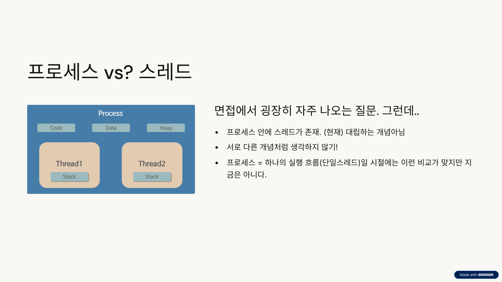
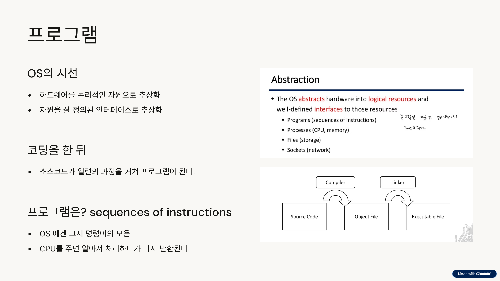
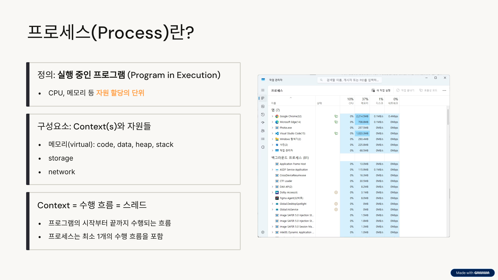
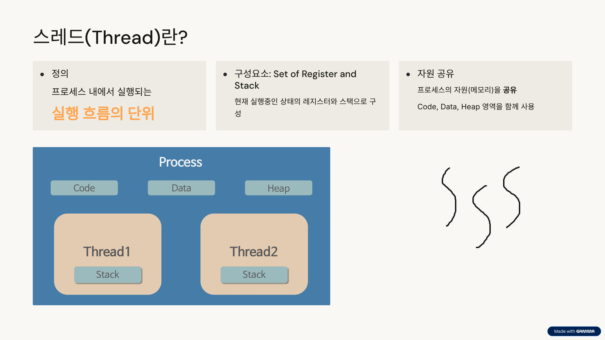
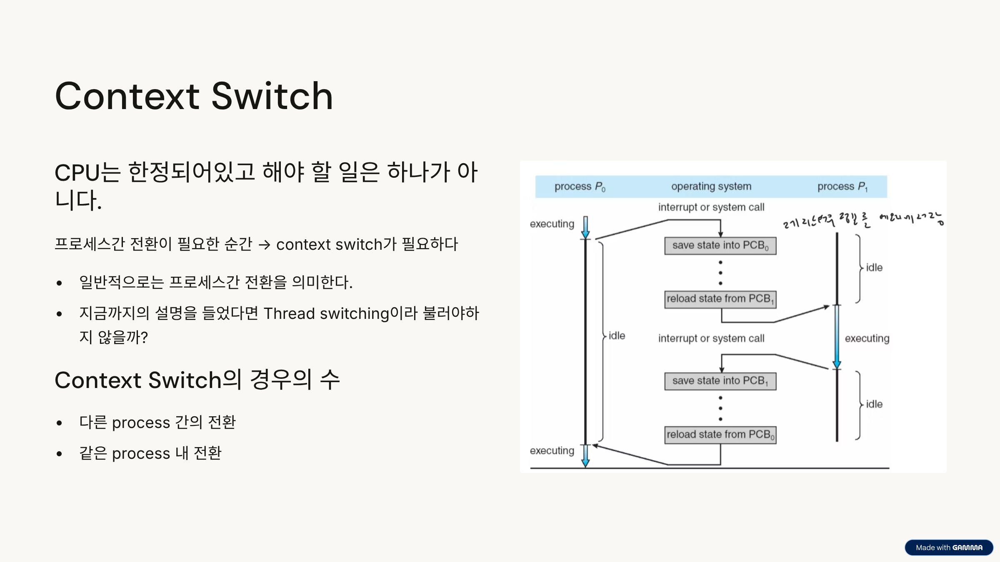
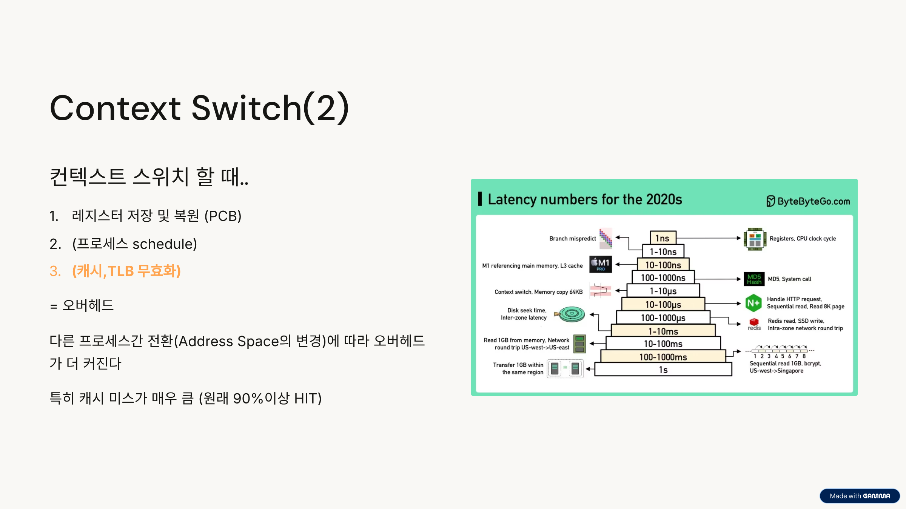
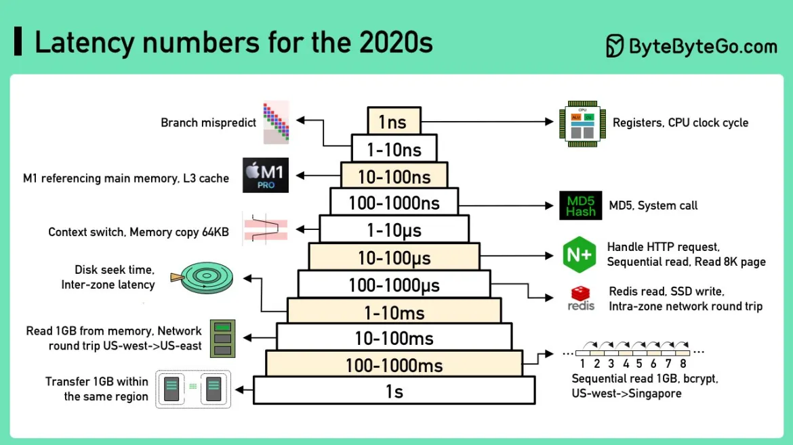
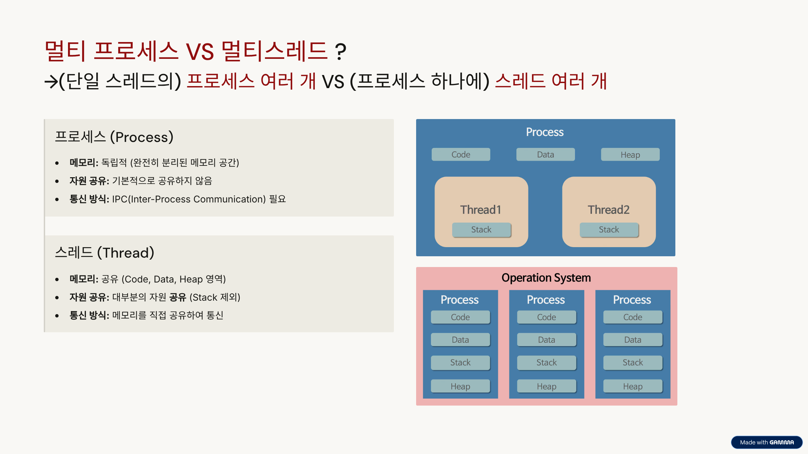
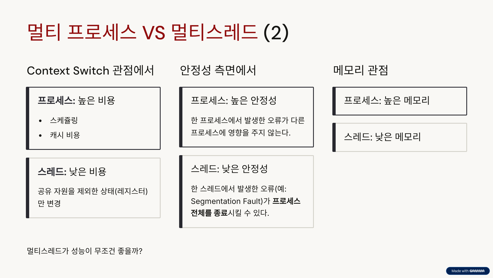

# Process vs Thread

## 면접에서 자주 나오는 주제인데..

사실 프로세스와 스레드는 대립하는 개념이 아닙니다.
설명하면서도 계속 강조하겠지만

- **프로세스(Process)**는 **자원 할당의 단위**이고,
- **스레드(Thread)**는 그 자원 내에서 **실행되는 단위**입니다.

옛날 운영체제에서는 프로세스가 단일 실행 흐름(단일 스레드)만을 가져 둘을 비교할수도 있었지만,
현대 운영체제에서는 프로세스 안에 스레드가 존재하는 형태가 일반적이기 때문에 지금은 아닙니다.

## 프로그램

### OS의 시선

OS는 하드웨어 자원(CPU, 메모리, 스토리지 등)을 잘 추상화하여 관리하고, 프로세스가 자원들을 효율적으로 사용할 수 있도록 돕습니다.

여러분이 작성한 **소스 코드**는 일련의 과정을 거쳐 실행 가능한 **프로그램**이 됩니다.  
그렇게 만들어진 프로그램은 **명령어들의 나열**(sequences of instructions)입니다.  
이 명령어들을 실행하기위해 OS로부터 **자원**(CPU, 메모리 등)을 할당받아야 합니다.  
그렇게 메모리에 적재되면 **프로세스(Process)**가 됩니다.

---

## 프로세스(Process)란?

- 앞서 설명했듯이 **프로세스**는 **실행 중인 프로그램**(Program in Execution)입니다.
- OS로부터 **CPU, 메모리 등 자원을 할당받는 단위**(중요)입니다.
- 프로세스의 주요 **구성 요소**는 **컨텍스트(Context)**와 **자원**입니다.
  - **자원:** 메모리, storage(파일), network(소켓) 등이 포함됩니다.
  - **컨텍스트:** 프로세스의 현재 상태(실행 흐름, 스레드 등)를 나타냅니다.

### context란?

여러분이 작성한 `main()`부터 `return 0;` 까지의 코드가 실행되는 동안, 수행되는 흐름이 바로 context입니다.

- 프로그램의 시작부터 끝까지 수행되는 **실행 흐름**입니다.
- 하나의 프로세스는 최소 1개 이상의 context를 포함합니다.

---

## 스레드(Thread)란?

### 정의

- **스레드**는 **프로세스 내에서 실행되는 실행 흐름의 단위**입니다.
- 즉 위에서 설명한 **context**는 프로세스의 실행 흐름 = **스레드**를 의미합니다.
- **프로세스**가 운영체제로부터 할당받는 **자원(메모리, CPU, 스토리지 등)의 단위**라면, **스레드**는 이 자원을 활용하여 실제로 **작업을 수행하는 실행 단위**라고 볼 수 있습니다.

### 구성요소

- 스레드의 **구성 요소**는 현재 실행 상태를 나타내는 **레지스터 세트**(Set of Register)와 **스택**(Stack)으로 이루어집니다.
- 레지스터는 연산 결과를 저장하는 레지스터 뿐만 아니라 프로그램 카운터(PC), 스택 포인터 등을 말합니다.

### 특징: 자원 공유

- 하나의 프로세스 내에 존재하는 스레드들은 해당 프로세스가 할당받은 **자원(메모리)을 공유**합니다.
- 구체적으로, **Code, Data, Heap 영역**을 함께 사용합니다.
- 반면, 스레드 고유의 실행 정보를 담는 **Stack 영역**과 **레지스터**는 스레드별로 독립적으로 가집니다.

---

## Context Switch

### Context Switch가 필요한 이유

우리는 컴퓨터에서 코딩뿐만아니라 유튜브, 웹서핑, 음악재생 등 여러 작업을 동시에 수행합니다.

- **CPU는 한정적**이며, 동시에 처리해야 할 일은 많습니다.
- CPU가 한 스레드를 처리하다가 다른 스레드로 **전환이 필요**한 순간에 **Context Switch(컨텍스트 스위치)가 발생**합니다.
- 일반적으로 context switch라 말하면 **프로세스 전환**을 의미하며, 스레드 전환을 **Thread switching**이라고 부르기도 하지만, 큰 범주에서는 동일한 메커니즘을 사용합니다.
- 앞에서 계속 context = thread 라고 설명했듯이 context switch는 thread를 바꾼다고 생각해도 좋습니다.

### Context Switch 종류

Context Switch는 크게 두 가지 경우에 발생합니다.

1.  **다른 Process 간의 context 전환:** 현재 프로세스(의 스레드)에서 다른 프로세스(의 스레드)로 전환되는 경우입니다.
2.  **같은 Process 내의 context 전환:** 현재 프로세스 내에서 여러 스레드 간에 전환되는 경우입니다.

---

### 컨텍스트 스위치 시 발생하는 오버헤드

Context Switch가 발생하면 다음과 같은 작업들이 진행됩니다

1.  **레지스터 저장 및 복원 (PCB):** 현재 실행 중이던 프로세스의 상태(CPU 레지스터 값 등)를 저장하고, 다음 프로세스의 상태를 로드하여 레지스터에 복원합니다.  
    (참고: PCB(Process Control Block)에 저장합니다)
2.  **프로세스 스케줄링:** 다음에 실행할 프로세스/스레드를 선택하는 과정이 필요합니다.
3.  **캐시, TLB 무효화:** 다른 프로세스로 전환(Address Space의 변경)되면서 기존 프로세스의 메모리 관련 정보가 담겨 있던 **캐시(Cache)**와 **TLB(Translation Lookaside Buffer)**를 무효화해야 합니다.

이 세가지가 context switch의 비용이자 오버헤드입니다.

### 오버헤드가 더 커지는 경우

- 만약 **같은 프로세스 내의 스레드 간 전환**이라면, 1번과 2번 항목의 오버헤드만 발생합니다.
- **다른 프로세스 간 전환**의 경우, 메모리 주소 공간(Address Space)이 바뀌기 때문에 위 3번 항목의 **캐시 및 TLB 무효화**가 필수적으로 발생하여 오버헤드가 더 커집니다.

그리고 이게 꽤 큰 오버헤드입니다. 일반적으로 프로그램의 캐시히트는 90% 이상이라 합니다. 그런데 context switch가 발생하면 이 캐시를 활용할 수 없게 됩니다.

데이터에 접근할때,

- 캐시 히트의 경우 거의 레지스터급의 속도(l1 캐시기준 대략 2~3ns)로 접근이 가능합니다.
- 그러나 캐시 미스의 경우 메모리 접근 속도(약200ns)까지 떨어집니다. 이 미스는 캐시가 다시 채워질 때까지 계속 발생하므로 context switch의 비용이 사진처럼 마이크로세컨드 단위로 커집니다.

---

## 멀티 프로세스 VS? 멀티 스레드

어떤 작업을 처리할 때, 여러 개의 실행 단위를 이용하는 방법으로는 **멀티 프로세스**와 **멀티 스레드**가 있습니다.  
여기도 vs에 ?를 붙여놓은 이유는 이 문장에 많은 것들이 생략 되어 있기 때문입니다.  
정확히 말하자면 (단일 스레드의) 멀티 프로세스 VS (단일 프로세스의)멀티 스레드 라고 해야 맞습니다. (멀티 프로세스이면서 멀티 스레드인 경우도 가능하기 때문)

각 특징은 아래 표와 같습니다.

### 멀티 프로세스 (Process)

| 구분          | 내용                                                                                                        |
| :------------ | :---------------------------------------------------------------------------------------------------------- |
| **메모리**    | **독립적**이고 **완전히 분리된** 메모리 공간(Address Space)을 가집니다. (Code, Data, Heap, Stack 모두 분리) |
| **자원 공유** | 기본적으로 **자원을 공유하지 않습니다.**                                                                    |
| **통신 방식** | 프로세스 간 통신을 위한 **IPC(Inter-Process Communication)** 메커니즘이 필요합니다.                         |

### 멀티 스레드 (Thread)

| 구분          | 내용                                                            |
| :------------ | :-------------------------------------------------------------- |
| **메모리**    | **공유**합니다. **Code, Data, Heap 영역**을 공유합니다.         |
| **자원 공유** | **대부분의 자원을 공유**합니다. (Stack 영역 및 레지스터는 제외) |
| **통신 방식** | **메모리 영역을 직접 공유**하여 통신하므로 IPC가 불필요합니다.  |

---

이제 이 두 가지 방식을 여러 관점에서 비교해보겠습니다.

### Context Switch 관점에서

| 구분         | 비용          | 설명                                                                            |
| :----------- | :------------ | :------------------------------------------------------------------------------ |
| **프로세스** | **높은 비용** | 메모리 주소 공간 변경으로 인한 **캐시 비용** (TLB 무효화 등)이 크게 발생합니다. |
| **스레드**   | **낮은 비용** | 상태(레지스터)만 변경하면 되므로 비용이 상대적으로 낮습니다.                    |

---

### 안정성 측면에서

| 구분         | 안정성          | 설명                                                                                                |
| :----------- | :-------------- | :-------------------------------------------------------------------------------------------------- |
| **프로세스** | **높은 안정성** | 한 프로세스에서 오류가 발생해도 다른 독립된 프로세스에는 영향을 **주지 않습니다.**                  |
| **스레드**   | **낮은 안정성** | 한 스레드에서 **Segmentation Fault**와 같은 오류가 발생하면 **프로세스 전체가 종료**될 수 있습니다. |

---

### 메모리 관점

| 구분         | 메모리          | 설명                                                                                                           |
| :----------- | :-------------- | :------------------------------------------------------------------------------------------------------------- |
| **프로세스** | **높은 메모리** | 각 프로세스마다 독립적인 메모리 공간을 할당받으므로 많은 메모리가 필요합니다.                                  |
| **스레드**   | **낮은 메모리** | 프로세스 자원을 공유하고 스레드마다 별도의 Stack 영역과 레지스터만 추가로 필요하므로 메모리 사용량이 낮습니다. |

---

> ### **멀티스레드가 무조건 좋을까?**
>
> 마치 성능만 보면 멀티스레드가 멀티프로세스보다 좋을 것처럼 오해할 수 있습니다.  
> 그러나 멀티스레드는 자원 공유로 인한 **동기화 문제**가 발생할 수 있으며, 안정성 측면에서도 취약합니다.  
> 작업의 성격(CPU 바운드, I/O 바운드)과 안정성(작업이 오류로 중단되면 위험한가?) 등을 고려하여 적합한 방식을 선택해야 합니다.
